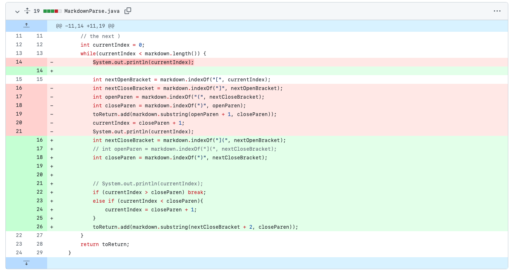
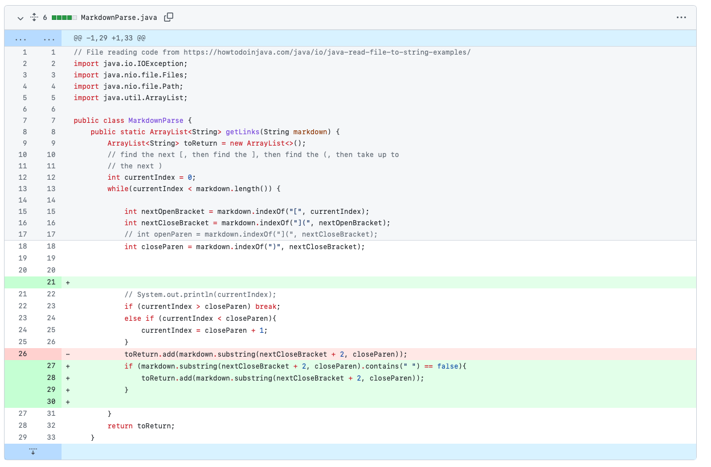
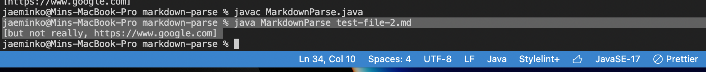
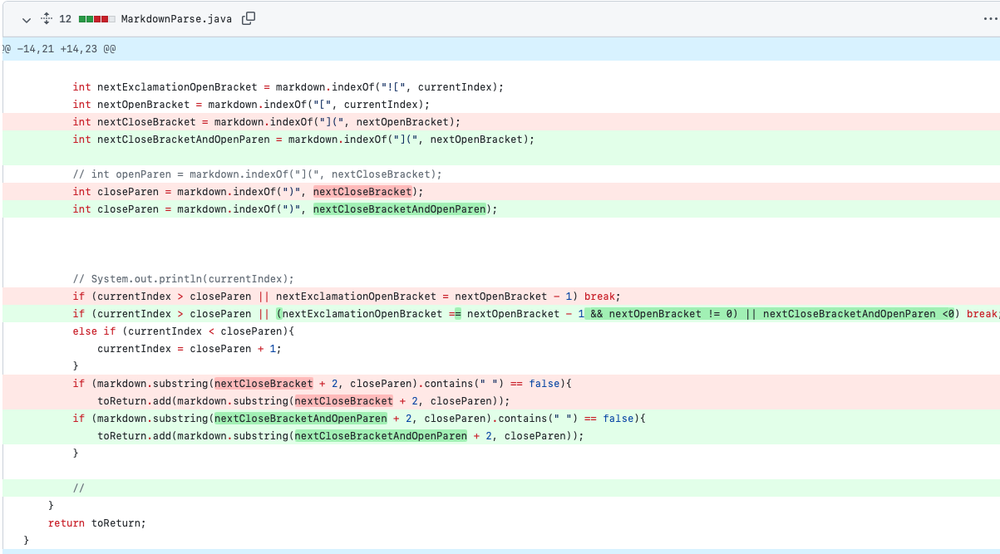

# Week 4 report


## Infinite Loop error




File :

```
# This test file will break the code

Sometimes I want to create some mayhem.
So lets take a look at this matrix: `[a b c d]`(but not really). It is a cool matrix.


```

This file caused an error when it ran, because it did not contain any links inside of it; Thus the while loop had no stopping condition and remained in an infinite loop.


## Fake link error



File :
```
# This test file will break the code

Sometimes I want to create some mayhem.
So lets take a look at this matrix: `[a b c d](but not really)`. It is a cool matrix.

[Hello World](https://www.google.com)

There's More.
```

Symptom :


This file caused an error, where it now thinks that the "but not really" is actually a link because it is in parentheses. To fix this, we now check if there is an empty space (" ") inside of the potential link to check its validity.

## Fake Brackets



File :
```
}[

```

Symptom:


This file caused an error, specifically the StringIndexOutOfBounds Exception. Adding the code to check if the )[ is right at the beginning (instead of the (  or [ ) fixed this error. 

