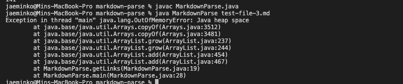
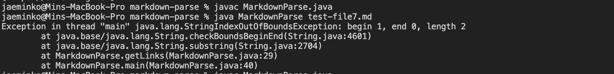

# Week 4 report

## Infinite Loop error

File :

[Error file](https://github.com/jaemin-capslock/markdown-parse/blob/main/test-file-3.md)

This file caused an error when it ran, because it did not contain any links inside of it; Thus the while loop had no stopping condition and remained in an infinite loop.

## Fake link error

File :

[Error file2](https://github.com/jaemin-capslock/markdown-parse/blob/main/test-file-2.md)

Symptom :

This file caused an error, where it now thinks that the "but not really" is actually a link because it is in parentheses. To fix this, we now check if there is an empty space (" ") inside of the potential link to check its validity.

## Fake Brackets

File :

[Error file 3](https://github.com/jaemin-capslock/markdown-parse/blob/main/test-file7.md)

Symptom:

This file caused an error, specifically the StringIndexOutOfBounds Exception. Adding the code to check if the )[ is right at the beginning (instead of the (  or [ ) fixed this error. 

